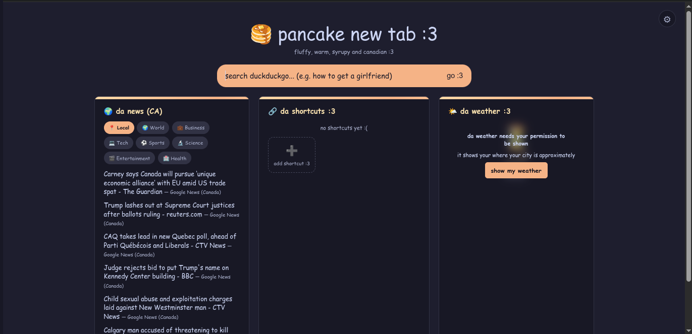

<div align="center">

# PancakeNewTab

**An another new tab :3**



**Test it [here!](https://pancake-new-tab.vercel.app/)**
</div>

## Features

- Uses DuckDuckGo search (i like privacy)
- Custom shortcuts
- Weather information for your approximate area
- News updates
- Ability to use different search engines
- Ability to switch between Celsius, Fahrenheit and Kelvin for weather :3

## Tech Stack

- HTML
- CSS
- JavaScript

## Prerequisites

- Node.js
- npm
- A web browser would be useful
- No api keys are needed

## How to Run from Source

1. Make sure you have Node.js and npm installed.
2. Install the dependencies by running:

```bash
npm install
```

3. Once that's complete, run the website:

```bash
npm run dev
```

4. Once it's ready, open it in your web browser at http://localhost:5173/.

## License

This project is licensed under the [MIT](LICENSE).